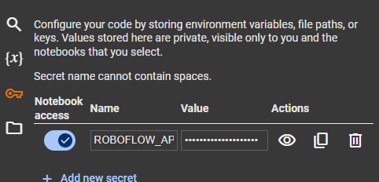
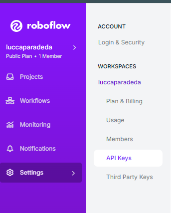
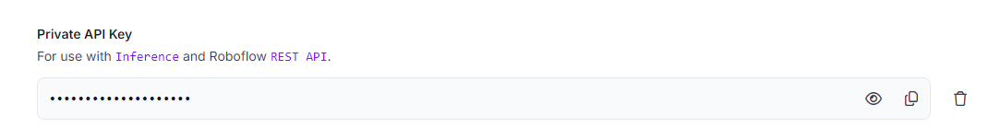

## Fine Tune do Yolo

Para rodar o fine tunning a forma mais simples é fazer o upload do arquivo para o google colab, utilizar uma GPU do ambiente para fazer o treinamento e adicionar nas variaveis de ambiente do colab a seguinte variavel:


```
ROBOFLOW_API_KEY
```

Crie uma conta no ROBOFLOW e pegue sua API_KEY nas configurações




Assim voce ja tem o ambiente setado para o treinamento do modelo.

## Demo Live

Crie um ambiente virtual python, e baixe os requirements.txt usando o pip install

Após é só executar o main.py para testar o modelo com fine tunning
Para comparação temos o base_model.py que tem o exemplo do modelo sem fine tunning
